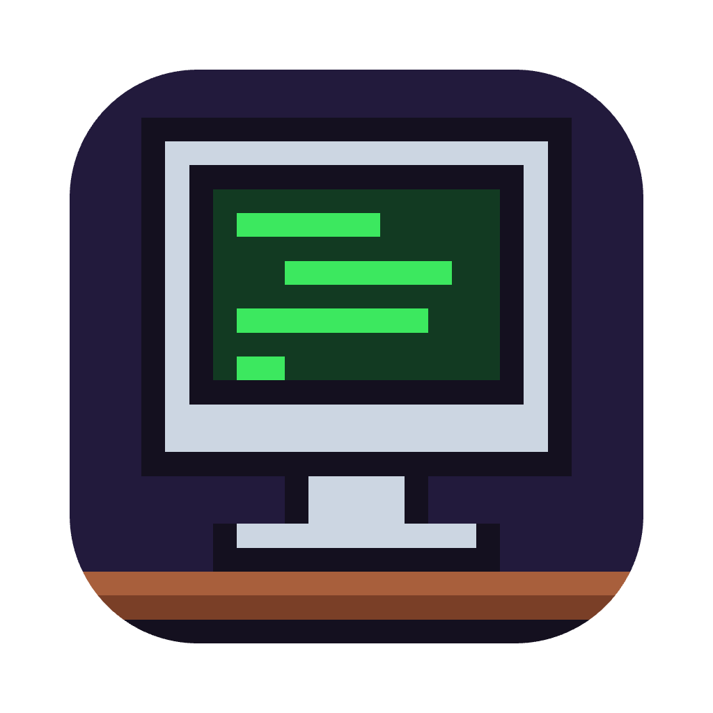
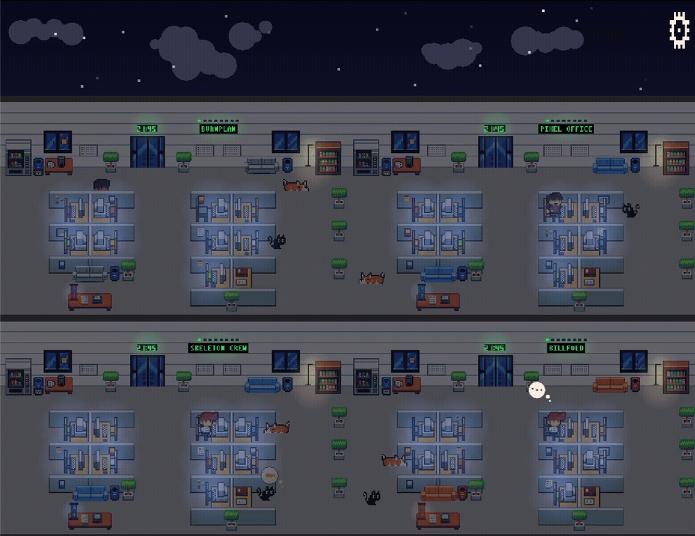

# Pixel Office

<p align="center">
  
</p>

A real-time pixel-art office for Claude Code and Codex sessions. Structured
agent lifecycle hooks make developers think, plan at whiteboards, write code,
run commands, wait for input, celebrate, fail tests, and return to their desks.
When developers remain idle, they occasionally patrol the office and talk to
coworkers before returning to work. Every agent is represented by the same
developer character system; behavior comes from state rather than job title.
Each project gets its own stable mix of computers, monitors, chair colors,
wall art, couches, trash cans, and lava-lamp colors. The cat and dog also start
at project-specific desk or lounge spots and occasionally roam through the
office.

<p align="center">
  
</p>

## Requirements

- JDK 17+
- Python 3
- Claude Code, Codex, or another source that emits the AgentEvent protocol

## Build and run

Run commands from the repository root:

```bash
./start.sh
```

Equivalent Gradle commands:

```bash
./gradlew desktop:run
./gradlew desktop:dist
./gradlew test
```

Starting the desktop application also starts the event receiver. There is no
separate server process to launch. By default, Pixel Office listens on
loopback only:

- UDP `127.0.0.1:9997` for live Claude Code and Codex events
- HTTP `http://127.0.0.1:3003/api/events` for canonical AgentEvent POSTs

## Install agent hooks

Install user-level hooks for both Claude Code and Codex:

```bash
python3 hooks/manage_hooks.py install
```

The installer:

- copies the fail-open event emitter to
  `~/.local/share/pixel-office/pixel_office_hook.py`
- merges Pixel Office handlers into `~/.claude/settings.json`
- merges Pixel Office handlers into `~/.codex/hooks.json`
- preserves existing settings and creates timestamped backups before changing
  existing files

Codex requires one additional trust step. Open `/hooks`, review the Pixel
Office definitions, and trust them.

Inspect or remove the integration:

```bash
python3 hooks/manage_hooks.py status
python3 hooks/manage_hooks.py uninstall
```

Uninstall removes only Pixel Office-owned handlers.

Restart sessions that were already open when hooks were first installed so
they load the new hook definitions. Updating and reinstalling the emitter at
the same path does not require restarting those sessions.

## Event behavior

| Agent hook | Office behavior |
|---|---|
| Session start | Spawn a developer at an idle desk |
| User prompt | Think, or plan at the whiteboard in plan mode |
| Read/search tool | Research |
| Edit/write/apply-patch tool | Write code |
| Shell/exec tool | Run a command |
| Ordinary tool completes | Resume thinking |
| Permission request | Wait for input |
| Successful test/build | Celebrate |
| Failed test/build | Despair |
| Turn stop | Return to the desk and idle |
| Session end | Leave the office |
| Subagent start/stop | Spawn/remove a coworker |

Pixel Office never receives prompts, command strings, tool arguments, tool
output, or file contents. The hook bridge converts those inputs into a small
state packet before sending it.

These states describe observable lifecycle boundaries. `coding` means an edit
or write tool is actively mutating files. While the model is composing that
edit before the tool starts—and after the tool returns—it appears as
`thinking`. Pixel Office does not infer hidden model intent.

## Event protocol

Any local tool can drive Pixel Office by sending the same JSON payload over a
UDP datagram or an HTTP POST:

```json
{
  "version": 1,
  "provider": "codex",
  "sessionId": "session-123",
  "agentId": "main",
  "projectId": "/absolute/project/path",
  "projectLabel": "pixel_office",
  "kind": "upsert",
  "state": "coding",
  "activity": "edit",
  "occurredAt": 1785452400000
}
```

Fields:

- `kind`: `upsert`, `touch`, or `end`
- `state`: `idle`, `thinking`, `planning`, `researching`, `coding`, `running`,
  `waiting`, `success`, or `failure`
- `occurredAt`: Unix epoch milliseconds; older updates for the same agent are
  ignored
- `provider`, `sessionId`, and `agentId`: stable agent identity
- `projectId` and `projectLabel`: office grouping and visible project name

Every session is rendered as a developer.

Agent identity is the combination of `provider`, `sessionId`, and `agentId`.
Projects fill the configured number of columns from left to right, then add
rows from top to bottom. The sky is shared across the first row; lower rows
repeat the office wall and floor without adding another sky. Sessions that
disappear without an end event expire after 30 minutes by default.

On desktop, the shared sky keeps its preferred 4x pixel height while the office
grid beneath it scales to fit the current monitor's work area. During a manual
resize, the edge moved furthest leads and the other dimension follows the
fixed-sky geometry, so the office stays undistorted without side margins. The
combined window is capped and centered when its layout changes; maximize,
fullscreen, and layouts too large for the display use the split fitted viewport.

### Send a synthetic event

```bash
python3 - <<'PY'
import json, socket, time

event = {
    "version": 1,
    "provider": "manual",
    "sessionId": "demo-session",
    "agentId": "main",
    "projectId": "/tmp/example",
    "projectLabel": "example",
    "kind": "upsert",
    "state": "planning",
    "activity": "plan",
    "occurredAt": int(time.time() * 1000),
}

sock = socket.socket(socket.AF_INET, socket.SOCK_DGRAM)
sock.sendto(json.dumps(event).encode(), ("127.0.0.1", 9997))
sock.close()
PY
```

The HTTP equivalent is:

```bash
curl -X POST http://127.0.0.1:3003/api/events \
  -H 'Content-Type: application/json' \
  --data-binary @event.json
```

Both transports accept one version-1 `AgentEvent` per packet or request. They
reject other payload shapes; there is no terminal-output or snapshot adapter.

## Running across a LAN

Pixel Office can receive events from other computers on the same network. On
the computer displaying the office:

1. Set `events.host` in `assets/config.json` to `0.0.0.0` or that computer's
   LAN address.
2. Restart Pixel Office.
3. Allow inbound UDP port `9997` through the host firewall. Allow TCP port
   `3003` as well if using the HTTP endpoint.

On each computer running agents, install the hooks with the Pixel Office
computer's LAN address:

```bash
python3 hooks/manage_hooks.py install --host 192.168.1.50 --port 9997
```

Replace `192.168.1.50` with the receiver's actual address. The receiver has no
authentication or encryption, so expose it only on a trusted network. The
bundled hooks use UDP; custom senders may use UDP or HTTP.

## Configuration

Runtime settings live in `assets/config.json`:

```json
{
  "events": {
    "enabled": true,
    "host": "127.0.0.1",
    "udp_port": 9997,
    "http_port": 3003,
    "stale_session_minutes": 30,
    "grid_columns": 2
  },
  "developer": {
    "idle_patrol_min_seconds": 20.0,
    "idle_patrol_max_seconds": 45.0,
    "idle_patrol_max_stops": 3,
    "social_duration_seconds": 3.0
  },
  "pets": {
    "enabled": true,
    "roam_min_seconds": 60.0,
    "roam_max_seconds": 120.0,
    "walk_speed": 20.0
  },
  "demo": {
    "enabled": false
  }
}
```

Desk appearance and initial pet placement are generated automatically from
the project ID. They stay the same across application restarts without a saved
layout file; changing a project's ID gives it a different office. Pet roaming
uses the same navigation paths as developers and never changes desk capacity.
Lounge furniture and the lava lamp use one coordinated Sunset, Forest, Ocean,
or Slate accent palette per project.
The tall desk block and shorter lounge block may also exchange sides. The
lower tree wall and printer-table/lava-lamp area move with their respective
blocks. Their walking routes mirror with the layout, and the orientation
remains stable for that project.

Set `demo.enabled` to `true` to disable live input and run the built-in
animation cycle. Demo keyboard controls:

| Key | Action |
|---|---|
| `1` | Spawn a developer |
| `2` | Think |
| `3` | Code |
| `4` | Fail a test |
| `9` | Cycle research, command, and success |

## Architecture

```text
Claude Code hooks ─┐
                   ├─> pixel_office_hook.py ─> UDP AgentEvent
Codex hooks ───────┘

Custom senders ─────────────────────────────> UDP or HTTP AgentEvent

AgentEventReceiver
  ─> AgentSessionStore
  ─> OfficeGrid
  ─> entity state machines
  ─> 2D renderer
```

The UDP receiver runs on a daemon thread and queues validated events. The
LibGDX render thread drains them, updates the session store, and synchronizes
the office grid. Network threads never mutate game entities directly.

The application has one 2D rendering path. Projects fill grid columns from
left to right and continue vertically as needed. The first row shares the sky;
additional rows repeat the office wall and floor without repeating the sky.

## Verification

Run the core and hook suites after changing event handling:

```bash
./gradlew :core:test --no-build-cache
python3 -m unittest discover -s hooks/tests -v
git diff --check
```

Stop a running Pixel Office instance before using `./gradlew clean`; removing
its build artifacts while the JVM is live can cause class-loading failures.
Rendering and layout changes should also be checked in the running application
at representative one-row and multi-row grid sizes.

## Troubleshooting

- No Claude activity: run `python3 hooks/manage_hooks.py status` and restart
  Claude Code after installing hooks.
- No Codex activity: open `/hooks` and trust the installed definitions.
- Receiver not running: start Pixel Office and look for the
  `[PixelOffice] Agent events listening` startup message.
- Hook errors: the emitter intentionally exits successfully even when Pixel
  Office is closed; run it through the unit tests to inspect mapping behavior.
- Port conflict: change both `events.udp_port` and the installer `--port`
  value, then reinstall hooks.
- Demo characters instead of live agents: set `demo.enabled` to `false`.
