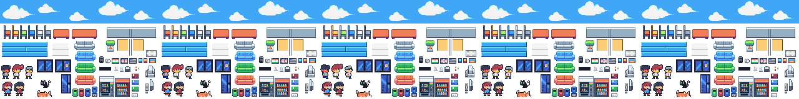

# Pixel Office

**A real-time pixel art visualization of Claude Code at work — watch AI agents think, code, debug, and despair in a tiny virtual office.**

<p align="center">
  
</p>

---

## What Is This?

> **Erlich:** Gentlemen. What you are looking at is not merely a "side project." What you are looking at is Pixel Office — a real-time, pixel-art office simulation that visualizes Claude Code's entire workflow as tiny developers walking around, typing, whiteboarding, and having existential crises when tests fail. It is, without exaggeration, the most important developer tool since... well, since whatever Gavin Belson is pretending he invented this week.
>
> **Richard:** Erlich, you didn't even—
>
> **Erlich:** Richard. I provided *vision*. I provided the *incubator*. I provided the kombucha. You provided... what, a state machine? Please. This is a billion-dollar visualization platform and I will not have you underselling it.
>
> **Jian-Yang:** It is like Tamagotchi, but for code. You watch little man die when test fail.
>
> **Erlich:** That is... actually not a terrible pitch.

---

## Quick Start

> **Jared:** Okay! So I'm going to walk you through getting Pixel Office running on your machine, and I just want you to know — I believe in you. Whatever your experience level, you deserve to see this build succeed.
>
> **Gilfoyle:** It's a Gradle project. You run one command.
>
> **Jared:** Yes, but *emotionally*, there's more to it than that. Let's start with what you'll need.

### Prerequisites

| Requirement | Version |
|---|---|
| JDK | 21+ |
| Gradle | Wrapper included (`./gradlew`) |
| OS | macOS, Linux, or Windows |

> **Jared:** JDK 21. That's important. Not 17, not 11 — *21*. I know change is scary, but you can do this. I've seen you do harder things. Well, I haven't *seen* you specifically, but I believe you have.

### Build & Run

```bash
# Run the application
./gradlew desktop:run

# Build a fat JAR for distribution
./gradlew desktop:dist

# Quick compile check (no run)
./gradlew compileKotlin
```

> **Jared:** On macOS, the desktop:run task automatically adds `-XstartOnFirstThread` for LWJGL3. You don't need to worry about that. I've worried about it enough for both of us.
>
> **Gilfoyle:** If your JDK isn't 21, the build will fail. And I'll know.
>
> **Russ Hanneman:** Hold on — you're telling me I can just type ONE COMMAND and little dudes start coding on my screen? That's like... that's like having a Lamborghini that drives ITSELF. *(looks at Jared)* This guy fucks.
>
> **Jared:** Oh! That's... thank you, Russ. That means a lot, actually. No one's ever— I'm fine. I'm fine.

---

## Connecting Claude Code via tmux

> **Big Head:** So, uh, I was messing around with tmux — I don't totally know what tmux is, to be honest — and somehow I got the office thing to show what Claude was doing? Like, in real time?
>
> **Richard:** You... you set up the TCP pipe?
>
> **Big Head:** I think so? I just kind of typed stuff and it worked.

### Step 1: Set `demo` to `false` in `config.json`

```json
{
  "demo": {
    "enabled": false
  }
}
```

> **Big Head:** Oh yeah, you gotta turn off the fake mode first. Otherwise it just does its own thing. Like me at Hooli.

### Step 2: Start Pixel Office

```bash
./gradlew desktop:run
```

The application starts a TCP server on port 9999 (configurable in `config.json` → `network.port`).

### Step 3: Pipe Claude Code's output

In the terminal where Claude Code is running (inside tmux):

```bash
tmux pipe-pane -o -t $TMUX_PANE 'nc localhost 9999'
```

> **Big Head:** That command sends everything Claude types to the little office. The `nc` part is netcat — it's like... a net. For cats. No wait, it's a network thing.
>
> **Gilfoyle:** It opens a TCP connection to localhost on port 9999 and pipes the tmux pane's output stream through it. The `TmuxReceiver` class listens on a `ServerSocket`, accepts the connection, and enqueues raw data into a `ConcurrentLinkedQueue` for the GL thread to poll.
>
> **Big Head:** Yeah. That.

### Network Configuration

In `config.json`:

```json
{
  "network": {
    "host": "localhost",
    "port": 9999,
    "buffer_size": 4096,
    "reconnect_delay": 5.0
  }
}
```

> **Big Head:** If port 9999 doesn't work you can change it to whatever. I accidentally used 8080 once and it connected to something else and the office got really confused.

---

## Demo Mode

> **Russ Hanneman:** Okay, forget the tmux pipe nerd stuff for a second. You want to see this thing GO? Demo mode. It's like a test drive in a McLaren — you don't need to know where you're going, you just need to feel the SPEED.

Set `demo.enabled` to `true` in `config.json`:

```json
{
  "demo": {
    "enabled": true
  }
}
```

> **Russ Hanneman:** Boom. Three devs, a PM, and a PO — auto-spawned. They cycle through states every 20 seconds, staggered by 2 seconds each, and let me tell you, watching those little guys walk to the whiteboard is like watching money MOVE.

### Demo Keyboard Controls

> **Russ Hanneman:** And check this out — NUM keys. You press a button, something happens. It's like the steering wheel buttons on my Lamborghini. My OTHER Lamborghini.

| Key | Action |
|---|---|
| `1` | Spawn a new developer |
| `2` | Trigger thinking |
| `3` | Trigger coding |
| `4` | Trigger test failure (+ camera shake) |
| `5` | Spawn Product Owner (asks question) |
| `6` | Dismiss Product Owner |
| `7` | Toggle PM sitting at desk |
| `8` | Toggle PO sitting at desk |
| `9` | Cycle: researching → command → celebrating |

> **Russ Hanneman:** Press 4. PRESS 4. The whole screen shakes and a GHOST comes out of the developer. A GHOST. When tests fail, a ghost literally leaves their body. That is a THREE COMMA feature.
>
> **Dinesh:** You... you know the three commas thing is about money, not feature count, right?
>
> **Russ Hanneman:** Everything is about money, Dinesh.

---

## Configuration

> **Gilfoyle:** `config.json` controls everything. If you don't understand it, you shouldn't be modifying it. If you do understand it, you probably still shouldn't, but at least you'll know what you broke.

### config.json Sections

| Section | What It Controls |
|---|---|
| `network` | TCP server host, port, buffer size, reconnect delay |
| `display` | Window size (320x240), FPS (30), title |
| `office` | Desk positions, whiteboard positions, walkable zones, furniture |
| `animation` | Frame durations for idle, walk, typing, thinking, ghost |
| `sprites` | Character/desk/whiteboard dimensions, color variants |
| `sprite_sheet` | Palette, transparent color, sprite definitions |
| `developer` | Walk speed (15), thinking duration (3s), despair duration (2s) |
| `project_manager` | Patrol speed, interrupt chance (0.1), interrupt duration (3s) |
| `product_owner` | Walk speed, question timeout (30s) |
| `demo` | Enabled flag, sample events file |

> **Gilfoyle:** The `developer.thinking_duration` controls how long the thinking state lasts before auto-transitioning to the whiteboard. The `despair_duration` is how long they sit in existential dread after tests fail. I set that to 2 seconds because real despair is infinite and we had to pick a number.
>
> **Dinesh:** Mine would be longer.
>
> **Gilfoyle:** I know.

### Settings Overlay (Runtime Customization)

> **Gavin Belson:** What I'm about to show you isn't merely a settings panel. It's a *platform* for self-expression. It's about making the world a better place — one desk configuration at a time.
>
> **Richard:** It's a settings overlay, Gavin.
>
> **Gavin Belson:** Richard, when I was at Hooli, I oversaw the customization of forty thousand workstations. Each one was a reflection of the human spirit. This... this is that, but pixel art.

Tap the top-right corner of the screen (or open programmatically) to access runtime desk customization:

| Option | Values |
|---|---|
| **Equipment** | Computer, Monitor, None |
| **Chair Color** | Black, White, Blue, Green, Orange |
| **Wall Decor** | Art, Small Art (Orange/Blue), Calendar, Notice, Post-it Notes, None |
| **Desk Items** | Red/Blue/Green Book, Notes, Document, Coffee Mug, None |
| **Developer** | Add/remove, assign color variant (0-3), assign to desk |
| **PM / PO** | Spawn toggle, assign to patrol or specific desk |

> **Gavin Belson:** You can change the chair color to *orange*. Do you understand what that means? It means freedom. It means choice. It means making the world a better place through customizable office furniture.
>
> **Jian-Yang:** I change all chair to green. It is better.
>
> **Gavin Belson:** You can't just— it's PER DESK, Jian-Yang.
>
> **Jian-Yang:** I change all desk. All green. Is better feng shui.

---

## Developer States

> **Gilfoyle:** There are exactly 11 states. Not 10, not 12 — 11. Each one represents a phase of the developer's workflow, mapped from real Claude Code tool usage. I'll explain them once. Take notes or don't. I won't repeat myself.

| # | State | Animation | Visual Effect | Triggered By | Duration |
|---|---|---|---|---|---|
| 1 | **IDLE** | Sitting idle | — | Default / return state | Indefinite |
| 2 | **THINKING** | Thinking pose | Thought bubble | `thinking_started` event | 3s → auto walks to whiteboard |
| 3 | **RESEARCHING** | Thinking pose | Thought bubble | `researching_started` event | Until interrupted |
| 4 | **WALKING_TO_WHITEBOARD** | Walking sprite | — | `planning_started` / thinking timeout | Until arrival |
| 5 | **AT_WHITEBOARD** | Thinking pose | Thought bubble | Reached whiteboard | 5s → walks back |
| 6 | **WALKING_TO_DESK** | Walking sprite | — | Done at whiteboard | Until arrival → writing code |
| 7 | **WRITING_CODE** | Typing animation | — | `code_writing_started` event | Until interrupted |
| 8 | **RUNNING_COMMAND** | Sitting idle | — | `command_started` event | Until result |
| 9 | **CELEBRATING** | Sitting idle | Success bubble | `command_succeeded` event | 1.5s → idle |
| 10 | **TESTS_FAILING** | Despair animation | Ghost rises from body | `tests_failed` event + camera shake | 2s → walks to whiteboard |
| 11 | **BEING_INTERRUPTED** | Sitting idle | Annoyed bubble | PM interruption | 3s → returns to previous state |

> **Gilfoyle:** TESTS_FAILING spawns a ghost that rises out of the developer's body. It's a pixel art representation of the soul leaving when CI goes red. It's the most honest piece of software visualization ever created.
>
> **Dinesh:** I wrote the ghost rendering, by the way.
>
> **Gilfoyle:** The ghost is three frames and a Y-offset. Don't strain your arm patting yourself on the back.

### Activity → Event → State Mapping

> **Gilfoyle:** This is how Claude Code tool invocations become office animations. The `StreamParser` detects tool use, `Patterns.kt` classifies the activity, and `handleActivity()` dispatches the event to the developer's state machine. If you can't follow this table, close the repository.

| Activity Type | Event Dispatched | Target State |
|---|---|---|
| `AGENT_SPAWN` | *(spawns new Developer)* | — |
| `THINKING` | `thinking_started` | THINKING |
| `PLANNING` | `planning_started` | WALKING_TO_WHITEBOARD |
| `FILE_READ` | `researching_started` | RESEARCHING |
| `WEB_SEARCH` | `researching_started` | RESEARCHING |
| `CODE_WRITING` | `code_writing_started` | WRITING_CODE |
| `CODE_EDITING` | `code_writing_started` | WRITING_CODE |
| `TEST_EXECUTION` | `command_started` | RUNNING_COMMAND |
| `BUILD_EXECUTION` | `command_started` | RUNNING_COMMAND |
| `BASH_EXECUTION` | `command_started` | RUNNING_COMMAND |
| `COMMITTING` | `command_started` | RUNNING_COMMAND |
| `INSTALLING_DEPS` | `command_started` | RUNNING_COMMAND |
| `TEST_FAILURE` | `tests_failed` + camera shake | TESTS_FAILING |
| `BUILD_FAILURE` | `tests_failed` + camera shake | TESTS_FAILING |
| `TEST_SUCCESS` | `command_succeeded` | CELEBRATING |
| `BUILD_SUCCESS` | `command_succeeded` | CELEBRATING |
| `USER_QUESTION` | *(spawns Product Owner)* | — |
| `UNKNOWN` | *(ignored)* | — |

> **Dinesh:** I just want to point out that the camera shake on test failure was MY idea.
>
> **Gilfoyle:** It was a parameter change. You changed a float.
>
> **Dinesh:** It was a *creative* float.

---

## Architecture

> **Richard:** Okay, so, the architecture — and I know this is going to sound complicated, but it's actually... it's actually quite elegant? I think? Let me just—
>
> **Erlich:** Richard, confidence. Project this.
>
> **Richard:** Right. Okay. Here's the full pipeline.

### The Pipeline

```
tmux pipe-pane ─→ TCP (port 9999) ─→ TmuxReceiver
                                          │
                                          ▼
                                     StreamParser
                                          │
                                          ▼
                              Patterns.detectToolActivity()
                                          │
                                          ▼
                                   DetectedActivity
                                          │
                                          ▼
                           PixelOfficeGame.handleActivity()
                                          │
                                          ▼
                              Developer.handleEvent()
                                          │
                                          ▼
                             DeveloperStateMachine
                                     ┌────┴────┐
                                     ▼         ▼
                              Animation    Bubble/Ghost
                                     │         │
                                     ▼         ▼
                                   RenderData
                                       │
                                       ▼
                                    Renderer ─→ Screen
```

> **Richard:** So, tmux pipes Claude Code's raw terminal output over TCP to port 9999. The `TmuxReceiver` is a `ServerSocket` running on a daemon thread — it accepts the connection and enqueues raw strings into a `ConcurrentLinkedQueue`. The GL thread polls that queue every frame.
>
> **Richard:** Then the `StreamParser` processes the raw data. Claude Code outputs JSON streaming format — `content_block_start`, `content_block_delta`, `tool_use`, `tool_result` — and the parser reassembles that into structured events. It tracks active agents and routes tool results back to the right agent.
>
> **Richard:** Then `Patterns.detectToolActivity()` classifies the tool. A `Write` tool becomes `CODE_WRITING`. A `Read` becomes `FILE_READ`. `Bash` gets sub-classified — it checks regex patterns for test commands, build commands, commit commands, and install commands. The priority order is: test > build > commit > install > generic bash.
>
> **Richard:** And then — okay this is the part I'm actually proud of — the `DetectedActivity` goes to `handleActivity()` which maps it to a state machine event, and the `DeveloperStateMachine` handles the transition. Each state is its own class implementing `enter()`, `update()`, `exit()`, and `onEvent()`. The state machine is completely decoupled from the parser. You could swap out the entire detection pipeline and the states wouldn't know.
>
> **Erlich:** That's what I was going to say.

### Rendering

> **Dinesh:** Okay, MY turn. The rendering pipeline. This is where it all comes together visually, and it's — frankly — it's beautiful work.
>
> **Gilfoyle:** It draws sprites.

> **Dinesh:** It draws sprites IN THE CORRECT ORDER, Gilfoyle. There's a typed render data system — `RenderData` — with `CharacterRenderInfo`, `DeskRenderInfo`, `WhiteboardRenderInfo`, and `EffectRenderInfo` which is a sealed class with `Bubble` and `Ghost` subtypes. Zero unchecked casts. ZERO.
>
> **Gilfoyle:** Congratulations on using Kotlin's type system as intended.
>
> **Dinesh:** The coordinate system is Y-down for world coordinates and Y-up for screen coordinates. The `Renderer` handles the `flipY` conversion. The `GameCamera` supports smooth panning, zooming, and a screen-shake effect that triggers on test failures. The office uses a `SpriteSheet` system that loads from the `sprite_sheet` config — palette-indexed with a transparent color index. Every frame, entities produce `RenderData`, and the renderer consumes it. No entity ever talks to the renderer directly.
>
> **Gilfoyle:** He rehearsed this.
>
> **Dinesh:** I did NOT rehearse this.

---

## Extending the Application

> **Richard:** So if you want to add new things, the architecture makes it pretty straightforward. I'll walk through the three main extension points.

### Adding a New Developer State

1. Add the state name to `DeveloperStateNames` in `states/DeveloperStates.kt`:
   ```kotlin
   const val MY_STATE = "my_state"
   ```
2. Create a new `State<Developer>` subclass:
   ```kotlin
   class MyState : State<Developer>(DeveloperStateNames.MY_STATE) {
       override fun enter(entity: Developer, prevState: State<Developer>?) { }
       override fun update(entity: Developer, dt: Float): String? = null
       override fun exit(entity: Developer, nextState: State<Developer>?) { }
       override fun onEvent(entity: Developer, event: String, data: Any?): String? {
           return when (event) {
               "some_event" -> DeveloperStateNames.IDLE
               else -> null
           }
       }
   }
   ```
3. Register it in `DeveloperStateMachine`:
   ```kotlin
   addState(MyState())
   ```
4. Add transitions TO your state from existing states' `onEvent()` methods.

> **Gilfoyle:** If your new state breaks existing transitions, that's your problem. The state machine has 11 states and they all work. Don't add a 12th unless you understand the first 11.

### Adding a New Activity Type

1. Add to `ActivityType` enum in `parsing/Patterns.kt`:
   ```kotlin
   MY_ACTIVITY,
   ```
2. Add detection logic in `Patterns.detectToolActivity()` or `classifyBashCommand()`.
3. Map it to a developer event in `PixelOfficeGame.handleActivity()`:
   ```kotlin
   ActivityType.MY_ACTIVITY -> {
       resolveDeveloper(activity)?.handleEvent("my_event")
   }
   ```

### Adding New Sprites

1. Add sprite definitions to `config.json` under `sprite_sheet`.
2. Reference the sprite name in `Renderer.kt` where needed.

> **Richard:** And, uh, if you're adding patterns for Bash command classification, the priority order matters. Test patterns are checked first, then build, then commit, then install. If your command matches multiple patterns, the first match wins.
>
> **Gilfoyle:** Don't add patterns that match `ls`. I will find you.

---

## Keyboard Reference

| Key | Action | Context |
|---|---|---|
| `ESC` / `Q` | Quit | Always |
| `F1` | Toggle debug overlay | Always |
| `F2` | Force sitting mode | Always |
| `F4` | Cycle label mode | Always |
| `F5` | Toggle night mode | Always |
| `Arrow Keys` | Pan camera | Always |
| `+` / Numpad `+` | Zoom in | Always |
| `-` / Numpad `-` | Zoom out | Always |
| `1` | Spawn developer | Demo only |
| `2` | Trigger thinking | Demo only |
| `3` | Trigger coding | Demo only |
| `4` | Test failure + shake | Demo only |
| `5` | Spawn Product Owner | Demo only |
| `6` | Dismiss Product Owner | Demo only |
| `7` | Toggle PM at desk | Demo only |
| `8` | Toggle PO at desk | Demo only |
| `9` | Cycle states | Demo only |

---

## Project Structure

```
pixel-office-libgdx/
├── assets/
│   ├── config.json                  # All configuration
│   └── sprites/                     # Sprite sheet PNG + JSON
├── core/src/main/kotlin/com/pixeloffice/
│   ├── PixelOfficeGame.kt           # Main game loop, input, demo mode
│   ├── animation/
│   │   └── SpriteSheet.kt           # Palette-indexed sprite loading
│   ├── core/
│   │   ├── Config.kt                # JSON config parser
│   │   └── EventBus.kt              # Event system
│   ├── entities/
│   │   ├── BaseEntity.kt            # Entity base class
│   │   ├── Developer.kt             # Developer agent entity
│   │   ├── Ghost.kt                 # Ghost effect (tests failing)
│   │   ├── ProductOwner.kt          # PO entity (user questions)
│   │   ├── ProjectManager.kt        # PM entity (interruptions)
│   │   └── ThoughtBubble.kt         # Bubble effects
│   ├── network/
│   │   └── TmuxReceiver.kt          # TCP socket server
│   ├── parsing/
│   │   ├── AnsiStripper.kt          # Terminal escape code removal
│   │   ├── Patterns.kt              # Activity detection + classification
│   │   └── StreamParser.kt          # Claude Code JSON stream parser
│   ├── rendering/
│   │   ├── GameCamera.kt            # Camera, zoom, shake
│   │   ├── RenderData.kt            # Typed render data classes
│   │   └── Renderer.kt              # All drawing, Y-flip, UI
│   ├── states/
│   │   ├── DeveloperStates.kt       # 11 states + state machine
│   │   └── StateMachine.kt          # Generic state machine
│   ├── ui/
│   │   ├── SettingsConfig.kt        # Runtime settings data model
│   │   ├── SettingsOverlay.kt       # Settings UI panel
│   │   └── SettingsSkin.kt          # UI theme/skin
│   └── world/
│       ├── AgentActivityTracker.kt   # Per-agent activity history
│       ├── CollisionMap.kt           # Collision detection
│       ├── DeskColumn.kt             # Desk layout DSL
│       ├── LineNetwork.kt            # Navigation graph
│       ├── LinePathfinder.kt         # A* pathfinding
│       ├── Office.kt                 # World state, entity management
│       └── Pathfinder.kt            # Pathfinding interface
├── desktop/                          # LWJGL3 desktop launcher
├── android/                          # Android module
├── ios/                              # iOS module (RoboVM)
└── gradle/                           # Gradle wrapper
```

---

> **Erlich:** And that, gentlemen, is Pixel Office. A real-time visualization engine for artificial intelligence, built on a custom state machine architecture with typed render data and zero unchecked casts. If that doesn't scream "unicorn," I don't know what does.
>
> **Jian-Yang:** Erlich. Your name is not in the code.
>
> **Erlich:** My name is in the VISION, Jian-Yang. The VISION.
>
> **Jian-Yang:** I search git log. You have zero commit.
>
> **Erlich:** ...This meeting is over.
